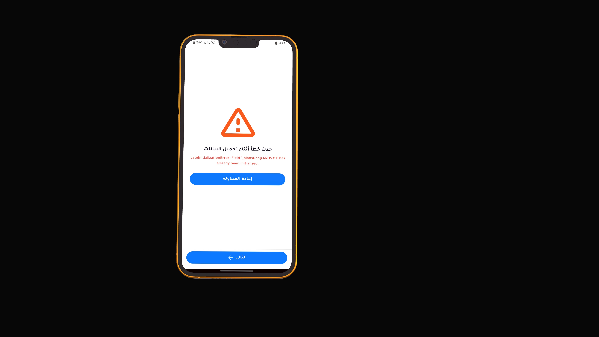
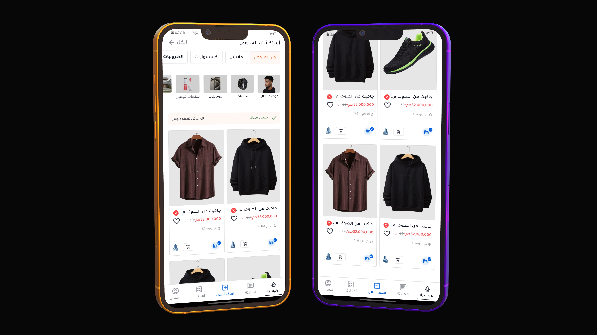
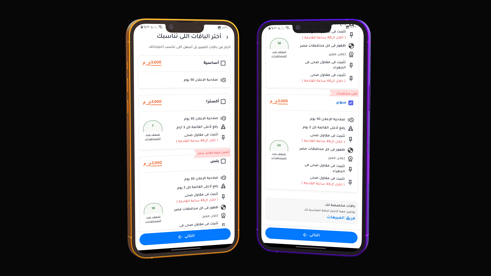
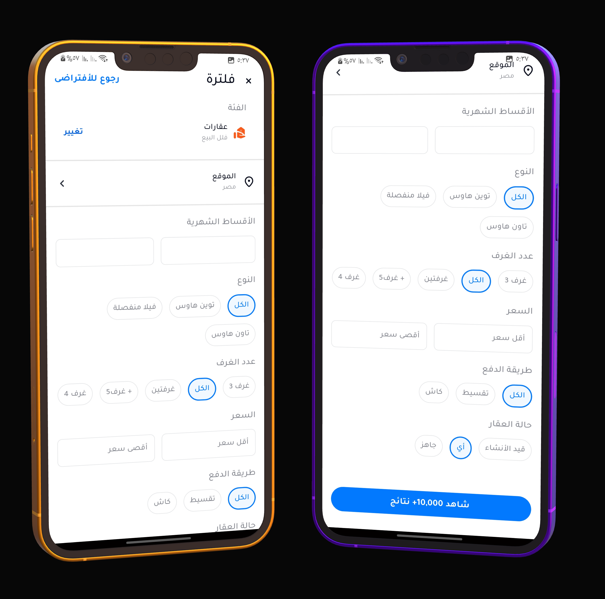

  <h1 align="center">
  
</h1>
  

    <i>A complete Flutter project with local database, state management, and clean architecture.</i>
  

---

## 🎯 Project Goal

The goal of this challenge is to **test the candidate’s skills** in:

- Implementing accurate **Flutter UI** from design.
- Managing **local data** using SQLite.
- Writing **clean, organized code** and publishing it on GitHub professionally.

---

## 📊 Project Management

- Progress tracked with [Trello Board](https://trello.com/invite/b/68ee5df4445c52ecfaf57349/ATTI8564ac27cb68ad0980daff7c0b5bcd39FB147423/flutter-it-legend-task)

---

<h2 align="center">📸 Screenshots</h2>

  
  

  
  

---

<h2 align="center">📦 Download APK</h2>

  
   
  <b>📱 Scan Me</b>
    
  <a href="https://github.com/Korya25/itlegend_flutter_challenge_mahmoud_mohamed/releases/download/v1.0.0/it_legend_flutter_challenge.apk" target="_blank">
    📲 Click here to download APK
  </a>

